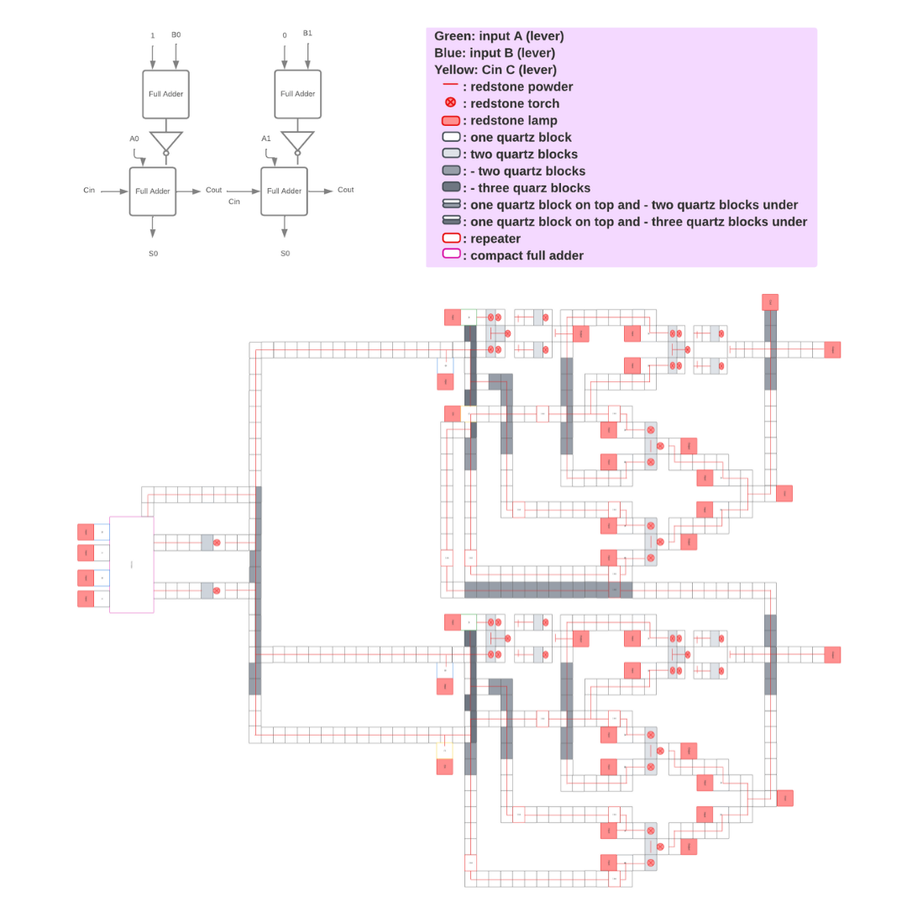
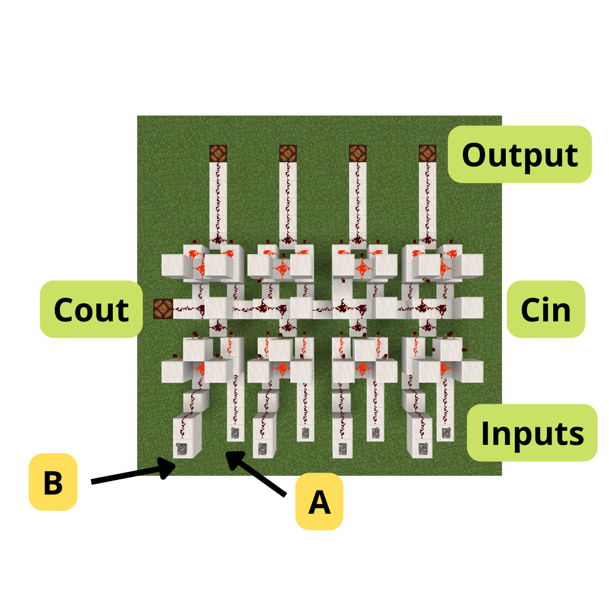

# Minecraft ALU

#### CMP-3004

#### Spring 2022

### Computer Organization

## Final Project

- Joel del Castillo
- Sebastián Mena
- Camila Zambrano

### Minecraft

Minecraft is a game created by Markus Persson, better known as Notch, and later developed by Mojang Studios, to finally be purchased in its entirety by Microsoft in 2014. The game has a sandbox structure, where the player is able to modify the terrain while building structures at will.

### Redstone and our project

One of the resources available in Minecraft is Redstone. This resource is obtained in the form of 'dust' and is capable of transmitting signals and giving power to other blocks found in the game. It works in a similar way to binary, where an element can only have two values, on or off.

Based on this principle, complex circuits can be built to automate processes within the game, as well as to simulate real-world circuits. There are multiple blocks within the game that allow the realization of these processes, however, these are very basic and none of them have the complexity of a logic gate, so building circuits within the game is a low level task and perfect for a project of this subject.

Our project consists of a functional **16-bit ALU** in Minecraft. All the processes that are performed in an in-game circuit are mechanical. Every change, comparison and interaction between redstone signals works at the hardware level (in-game) so the more bits, the higher the complexity of the ALU.

## Boolean algebra

- Operations based on True and False values
- When electricity is flowing we'll call it True, otherwise False
- True and False can be represented as 1 and 0
- Three main operations
  - NOT
  - AND
  - OR

## NOT

## AND

### Theory

### Implementation

## OR

### Theory

### Implementation

## XOR

### Theory

### Implementation

## HALF Adder

### Theory

### Implementation

## FULL Adder

### Theory

### Implementation

## FULL Adder / Substractor 2bits

### Theory

### Implementation

## Compact full adder (4BITS)

### Implementation

## ALU 16 BITS

### Theory

### Implementation (without flags)

### Implementation (complete)

